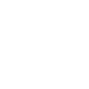

<div align="center">



# tensor-ide

**A self-hosted AI IDE by [Tensorfield Labs](https://tensorfieldlabs.com)**


</div>

---

## Features

- **AI chat** — Claude, Gemini, Groq, Ollama with tool use
- **Code editor** — Monaco with syntax highlighting
- **Terminal** — WebSocket PTY
- **File explorer** — full filesystem access
- **Twin mode** — dual IDE panes with agent + human side by side
- **ML viewers** — images, video, CSV, Jupyter notebooks, GGUF/safetensors

## Setup

**Docker (recommended):**
```bash
docker compose up --build
```

**Manual:**
```bash
pip install -r requirements.txt
pnpm install && pnpm build
python3 main.py
```

Open `http://localhost:41900`. On first launch a PIN is generated and saved to `~/.tensor/ide_pin`.

## Dev

```bash
pnpm run dev:runtime
```

## Configuration

| File | Purpose |
|------|---------|
| `~/.tensor/ide_pin` | Login PIN (auto-generated on first run) |
| `~/.tensor/groq_key` | Groq API key |
| `~/.gemini/oauth_creds.json` | Gemini OAuth credentials |

## Stack

| Layer | Tech |
|-------|------|
| Backend | FastAPI + uvicorn |
| Frontend | React + Vite + Monaco |
| AI | Claude, Gemini, Groq, Ollama |
| Terminal | WebSocket PTY |
| Auth | PIN-based, 12-hour sessions |
